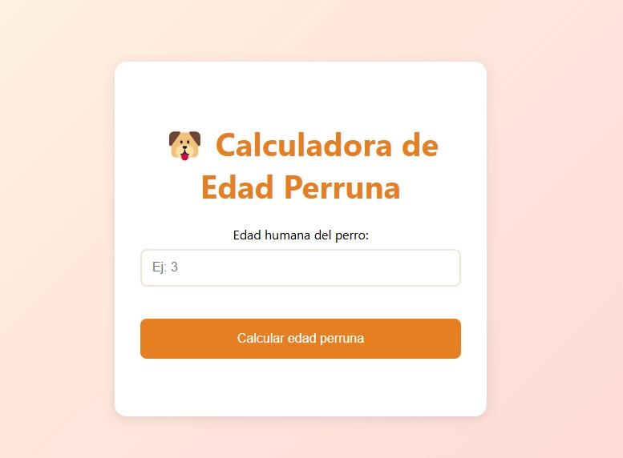

# 🐾 Calculadora de Edad Perruna 🐶

## Descripción del Proyecto
Aplicación web que permite calcular la edad equivalente de un perro en "años perrunos" a partir de su edad humana. El proyecto combina HTML, CSS y JavaScript para ofrecer una interfaz intuitiva con validación de datos y respuesta visual inmediata.

---

## Características Principales
✅ **Diseño Responsive**  
- Interfaz adaptable a dispositivos móviles y desktop  
- Gradiente suave y animaciones en botones  
- Iconografía amigable (emojis de perritos)

✅ **Validación de Datos**  
- Verifica que la entrada sea numérica y mayor o igual a 0  
- Muestra mensajes de error claros en tiempo real

✅ **Cálculo Automático**  
- Implementa la fórmula tradicional:  
  `Años perrunos = Años humanos × 7`  
- Respuesta interactiva con animación de resultado

✅ **Experiencia de Usuario**  
- Feedback visual al pasar el cursor sobre el botón  
- Resultados destacados con tipografía en negrita  
- Colores cálidos y paleta atractiva

---
